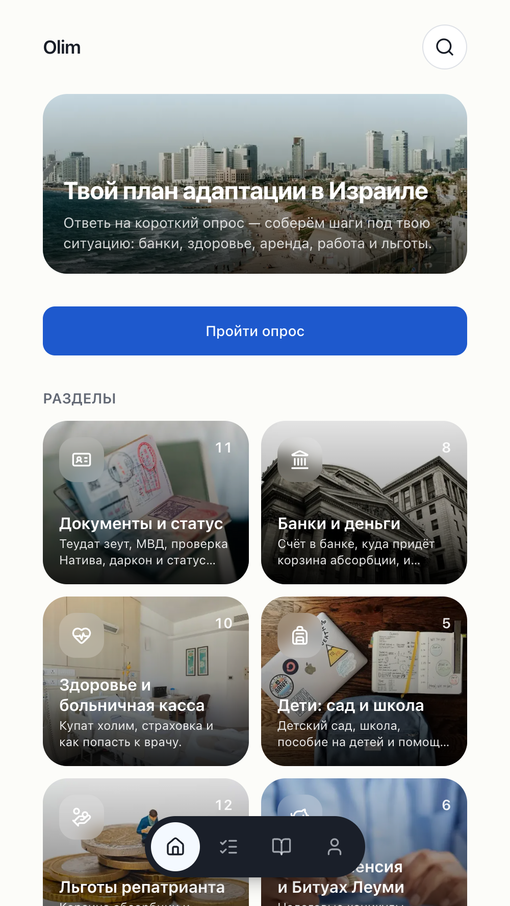
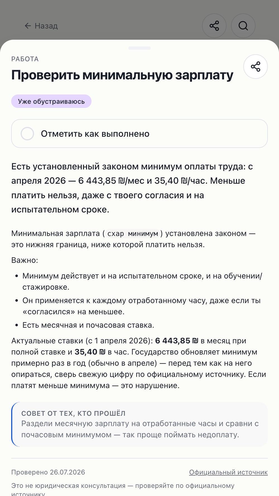
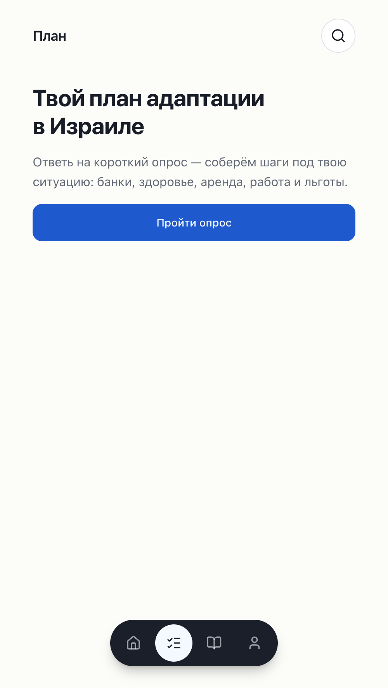
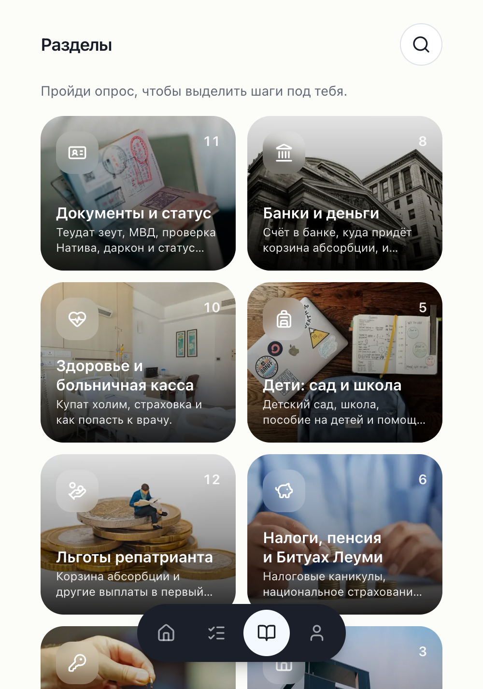
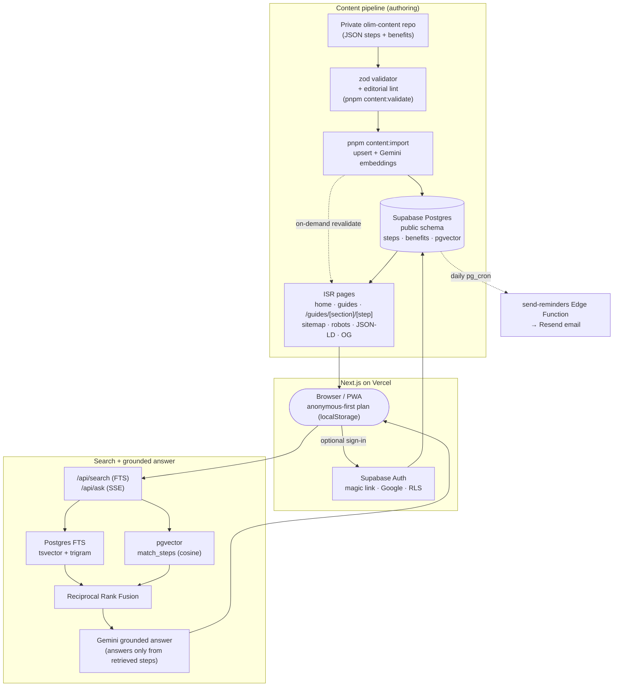

# Olim App

**A free adaptation navigator for new immigrants (_olim_) in Israel.** Answer a short
quiz about your situation and get a personalized plan: what to do after landing —
banks, health fund, rent, work, benefits, Hebrew — as trackable steps with deadline
warnings, full-text + AI search grounded in official sources, and a shareable plan.
Russian/English, light/dark, PWA-first (works offline at the airport).

**Live:** https://olimguide.online · **Stack:** Next.js (App Router, TS strict) ·
Supabase (Postgres · Auth · pgvector) · Tailwind + shadcn/ui · next-intl · Gemini
(embeddings + grounded answers) · Vercel.

> Built as a public portfolio project via a phased, AI-assisted workflow — see
> [`docs/CASE_STUDY.md`](docs/CASE_STUDY.md) for the "0 → product" engineering story.

## Screenshots

| Home (personalized) | Step (bottom sheet) | Plan (tracker) | Guides (photo tiles) |
|---|---|---|---|
|  |  |  |  |

## What it does

- **Onboarding quiz → personalized plan.** 5–7 questions (lifecycle stage, eligibility
  basis, country, family, city, dates) feed a pure `buildPlan(answers, steps)` engine
  that filters/sorts steps and computes deadline warnings. Anonymous-first: the plan
  lives in `localStorage` until you (optionally) sign in.
- **Practical guides.** 16 sections / 111 steps sourced from gov.il, Kol Zchut, Bituach
  Leumi & Nativ — each step carries its `source_url` and a visible `last_verified_at`,
  with a "report outdated" path and a "not legal advice" disclaimer.
- **Search — keyword + AI.** Postgres full-text (russian tsvector + trigram typo
  tolerance) plus a grounded AI answer ("Спроси об Израиле") that may speak **only**
  from retrieved steps, cites them as source cards, and honestly refuses when it can't.
- **Trackable plan + sharing.** Progress by lifecycle stage; share a read-only
  `/plan/{slug}` with an OG-image unfurl for Telegram/WhatsApp.
- **Accounts + reminders.** Supabase Auth (magic link + Google) with owner-scoped RLS,
  first-sign-in plan migration + cross-device sync, and opt-in email deadline reminders
  (Edge Function + Resend, scheduled via `pg_cron`).
- **PWA.** Installable, offline access to your plan and viewed steps ("at the airport
  with no connection" is scenario #1).

## Architecture

Two data planes: a **content pipeline** (private repo → validated → Supabase → ISR
pages) and a **retrieval + answer** path (hybrid FTS + vector → grounded LLM behind an
eval gate). User data is **anonymous-first** and only touches an account when the user
chooses to sign in.



**Key decisions** (full rationale in [`docs/CASE_STUDY.md`](docs/CASE_STUDY.md) and
[`docs/ARCHITECTURE.md`](docs/ARCHITECTURE.md)):

- **Content is data, not code.** Guide text lives in a private repo, passes a zod +
  editorial validator, and is imported into Supabase; components never hardcode content.
  Every figure carries a source and a verification date.
- **Grounded RAG with an eval gate.** The answer model is instructed to reproduce only
  what's in the retrieved context; a committed 66-question `pnpm eval` gate asserts ≥90%
  pass, **0 fabricated sources, 0 contradicted facts** before grounding can regress.
- **Anonymous-first.** No account needed to get value; the plan syncs to an account only
  on opt-in sign-in, with RLS on every user-data table.
- **Shared database, guarded.** The Supabase project is shared with another site;
  migrations are additive + `public`-scoped, gated by a documented backup ritual.

## Quick start

```bash
pnpm install     # installs deps + git hooks (lefthook)
pnpm dev         # http://localhost:3000
```

Without a database the app renders the committed content **fixtures**, so home, guides,
quiz and plan work out of the box. `/dev/ui` shows the component kit.

### Data layer (full content)

1. Install the `supabase` CLI and start Docker.
2. `pnpm db:start` — boots the local stack and applies migrations (`pnpm db:reset` to
   re-apply; `supabase status` prints local URLs/keys).
3. `pnpm content:import` — seeds from `content/fixtures/` (add `--dir ../olim-content/content`
   for the full private set; computes embeddings when `GEMINI_API_KEY` is set).

Real content lives in the **private `olim-content` repo** (clone as a sibling
`../olim-content`); format in [`docs/CONTENT_SCHEMA.md`](docs/CONTENT_SCHEMA.md). The
Supabase project is **shared** — migrations are additive + `public`-scoped and
destructive commands against the linked remote are forbidden (`AGENTS.md` rules 6 & 7).

## Quality bar (CI-enforced)

- **TypeScript** strict, `noUncheckedIndexedAccess`, no `any`; **Biome** lint/format.
- **Vitest** — 294 unit tests; `lib/` ≥80% coverage, the condition engine **100%**.
- **Playwright** e2e smoke + **axe** (0 critical/serious, both themes).
- **Lighthouse mobile** (hard gates, every route): Performance ≥90, A11y ≥95; JS
  first-load regression guard ≤280KB.
- **`pnpm eval`** — the AI grounding gate (path-triggered in CI): 66/66 = 100%, 0
  fabricated, 0 contradicted.

Full command list in [`AGENTS.md`](AGENTS.md).

## How this project is built

Development runs in **phases**, each executed by a separate Claude Code session and
reviewed by a team-lead session:

- [`AGENTS.md`](AGENTS.md) — canonical instruction file for all AI agents (read first)
- [`docs/ROADMAP.md`](docs/ROADMAP.md) — the 10-phase plan, standards, acceptance checklists
- [`docs/ARCHITECTURE.md`](docs/ARCHITECTURE.md) — system design · [`docs/CONTENT_SCHEMA.md`](docs/CONTENT_SCHEMA.md) — content format
- [`docs/CASE_STUDY.md`](docs/CASE_STUDY.md) — the "0 → product" engineering story
- [`docs/PHASE_REPORTS/`](docs/PHASE_REPORTS/) — one report per completed phase
- [`CONTRIBUTING.md`](CONTRIBUTING.md) — phase workflow, local setup, commit/PR & content conventions
