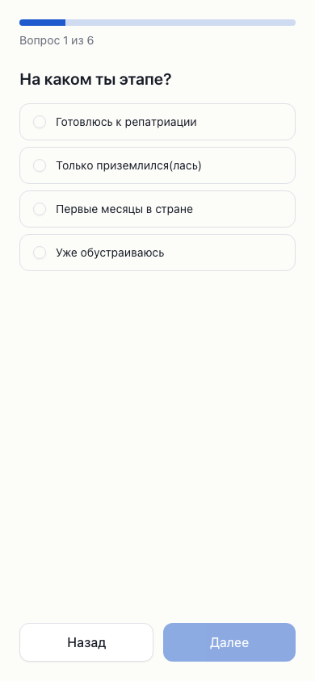
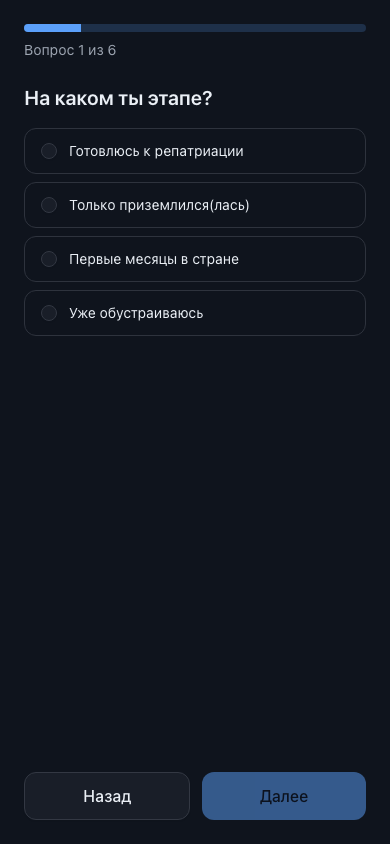

# Phase 3 — Onboarding and personalization engine

Status: **complete** (3a onboarding quiz · 3b condition engine).

Branch: `phase-3/onboarding-and-engine`. Commits:
- `feat(plan): condition engine + onboarding profile (Phase 3b)`
- `feat(onboarding): quiz flow + plan preview (Phase 3a)`
- `refactor(content): split schema into client-safe vocabulary + server tables`
- plus this report + ARCHITECTURE update.

Scope held: no Home/section screens, no analytics, no accounts (Phases 4/7). The
plan preview is a deliberately minimal, stage-grouped list purely to prove the
engine end-to-end.

---

## 3b — Condition engine ✅ (the product core)

`lib/plan/build-plan.ts` — pure `buildPlan(answers, steps, now?) → PersonalPlan`:
- **filters** by the full `cond` language (stage, basis, country, family, pet,
  `children_ages` / `months_in_country` ranges). Absent key = no constraint; a
  condition that needs an answer the person did not give does not match.
- **sorts** by lifecycle stage (`preparing → just_landed → first_months →
  settled`, no-stage last) then `sort_order` then slug.
- **warns**: resolves each `warn_rule` against the person's flight/arrival dates
  into a concrete deadline, reusing `getDeadlineStatus` (`lib/deadline.ts`).

**100% coverage** on the engine (70/70 stmts, 69/69 branches, 14/14 funcs) — every
cond key alone and combined, range boundaries (min-only / max-only / inclusive),
all three warn types with date-math edges (today / overdue / future / missing
anchor). `lib/plan/profile.ts` is the versioned localStorage profile, validated by
the shared content vocabularies (no parallel enums).

### Reference personas (`answers → plan size → unique steps`)

Snapshot-tested in `lib/plan/personas.test.ts` against a dimension-covering step
set; all six plans are asserted exactly and proven pairwise-distinct.

| Persona | stage / basis / family | plan size | distinguishing steps |
|---|---|---|---|
| single preparing (RU) | preparing / jewish / single | 4 | prep-documents, nativ-check |
| family w/ kids just landed (KZ) | just_landed / jewish / with_children | 5 | land-bank, land-kupat (deadline), kids-school |
| grandchild_of_jew preparing (RU) | preparing / grandchild_of_jew / couple | 5 | prep-grandchild-archive, nativ-check |
| spouse settled 8 months | settled / spouse / couple | 3 | ulpan (months_in_country < 12 excludes rent-assistance) |
| single_parent w/ pet just landed | just_landed / jewish / single_parent | 7 | prep-pet-import, single-parent-support, kids-school |
| returning_citizen first months | first_months / returning_citizen / single | 4 | returning-citizen-note |

Warnings ride along where a `warn_rule` + arrival date exist (e.g. land-kupat →
`2026-07-01 + 90d = 2026-09-29`).

## 3a — Onboarding quiz ✅

`/onboarding` — one-question-per-screen client flow with a progress bar, back
navigation, and conditional questions (children ages only for households with
children; arrival date only once in country; flight date only while preparing).
Answers build the versioned `olim.profile.v1` profile; on finish the engine runs
client-side and renders a stage-grouped **plan preview** with deadline hints.
"Edit answers" and "start over" live on the preview. RU dictionary with EN keys
ready; stage labels are shared between the quiz and the preview headers.

Data source this phase: the committed `content/fixtures/` via the content loader
(server route → client flow). Real Supabase wiring is Phase 4.

### shadcn-first audit

Registry checked via the shadcn MCP server (`search_items_in_registries` /
`view_items_in_registries`).

| Need | Registry item | Decision |
|---|---|---|
| Single-choice options | `radio-group` (registry:ui) | **Installed.** Radix radios, adapted to our tokens; each option is a ≥44px `<label>` row wrapping an `aria-label`led `RadioGroupItem` (small dot, big tap target). |
| Progress indicator | `progress` (registry:ui) | **Installed.** Semantic-token bar. |
| Free-text / number / date inputs | `input` (already ours) | Reused. Native `type="date"` / `type="number"` for the date and age inputs. |
| Age chips | `badge` (already ours) | Reused for the children-ages chips. |
| Layout / actions | `button` (already ours) | Reused. |

No new dependencies — `radio-group`/`progress` sit on the existing `radix-ui`
umbrella. `field-radio` / `form-*` registry examples were considered but the quiz
needs full-row tap targets and shared-vocabulary options, so a thin custom
`OptionRow` composing `RadioGroupItem` fits better than the example wiring.

## Verification

| Check | Command | Result |
|---|---|---|
| Typecheck | `pnpm typecheck` | ✅ |
| Lint/format | `pnpm lint` | ✅ (80 files) |
| Unit + coverage | `pnpm test:coverage` | ✅ 149 tests; engine **100%**, all-files 95.5% stmts / 91.1% branches |
| e2e + axe (both themes) | `pnpm e2e` | ✅ quiz → preview → reload persists → edit changes plan; axe clean on intro / question / preview, chromium + Pixel 7 |
| Lighthouse (mobile) | `pnpm lighthouse` | ✅ `/onboarding` perf 0.95, a11y 1.0; `/` 0.96/1.0; `/dev/ui` 0.96/1.0 |
| Build | `pnpm build` | ✅ 4 static routes (`/onboarding` added) |

Screenshots (Pixel-7 viewport, both themes) in
`docs/PHASE_REPORTS/assets/phase-3/`:

| | Light | Dark |
|---|---|---|
| Quiz |  |  |
| Plan preview |  |  |

## Deferred / debts

1. **`/onboarding` JS first load ≈ 247KB** (perf still 0.95 / a11y 1.0). The quiz
   ships zod for client-side answer validation against the shared content
   vocabulary (the "no parallel enums" requirement). Splitting the content schema
   into a client-safe vocabulary vs. server table schemas kept the table schemas
   out of the browser but zod core dominates the delta. The Lighthouse JS guard is
   therefore per-URL: 256KB for `/onboarding`, 200KB for content pages; perf/a11y
   remain the hard gates. Revisit if a lighter client-validation path is wanted.
2. **Preview is intentionally minimal** — a plain stage-grouped list, not the real
   Home/Plan UI (Phase 4/5). No StepCard/DeadlineBadge composition yet.
3. **Country list is a short curated set** (+ "other"); free-text origin countries
   are not collected. `city` is stored but unused until Phase 4's greeting.
4. Profile is localStorage-only (no accounts until Phase 7); the versioned key
   discards on a schema bump rather than migrating.

## Verification commands

```
pnpm typecheck && pnpm lint
pnpm test:coverage        # engine 100%; persona snapshots
pnpm e2e                  # onboarding flow + axe, both themes, mobile + desktop
pnpm lighthouse           # per-URL budgets
```
