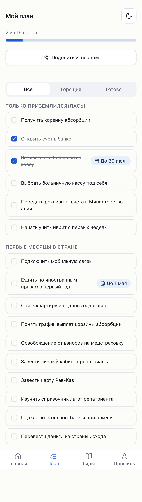
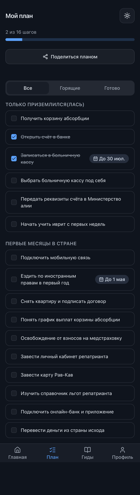
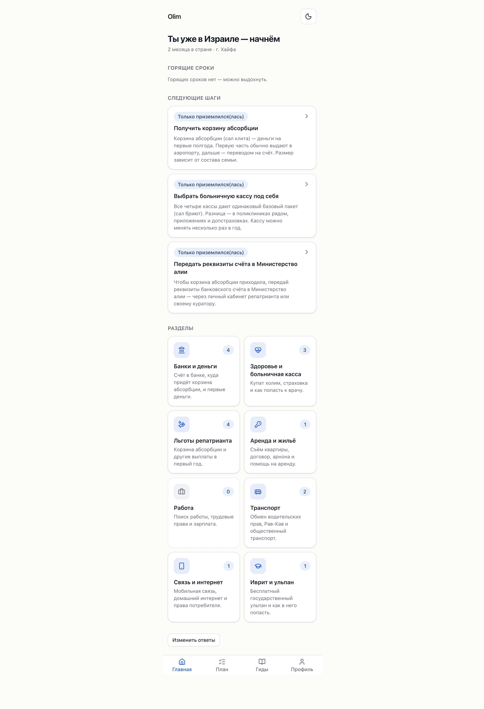
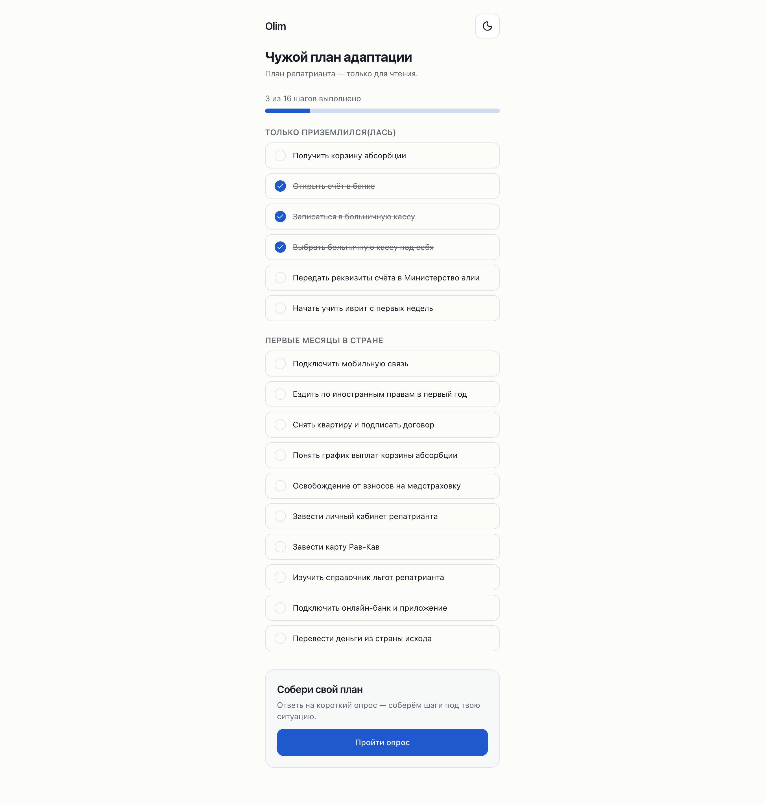
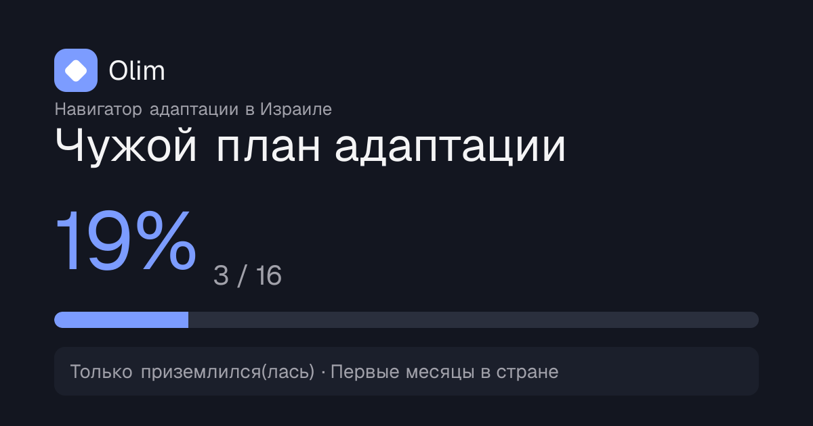
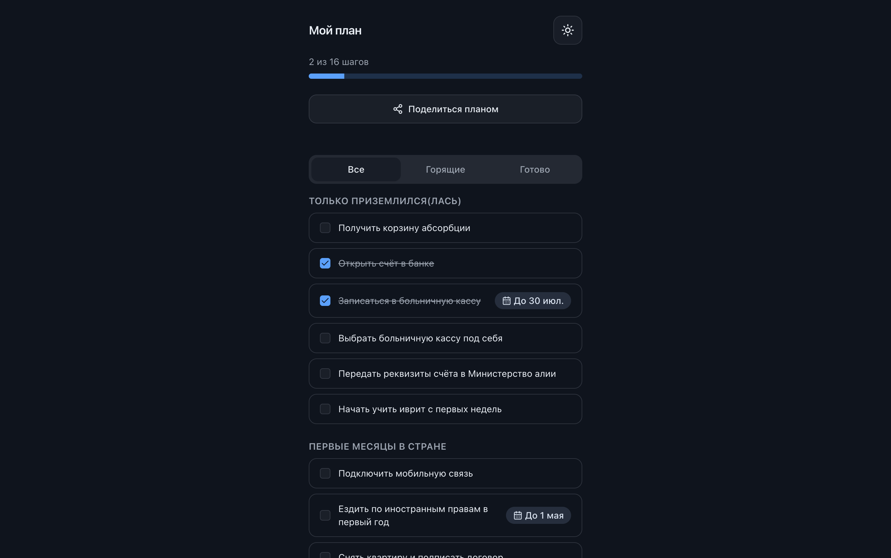
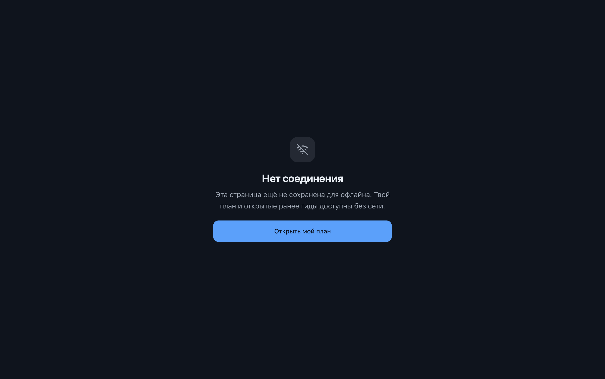

# Phase 5 — My plan, sharing, PWA

Status: **complete** — code (5a · 5b · 5c) + housekeeping, fully verified locally
(unit, e2e incl. the DB-backed share round-trip, Lighthouse, PWA/offline, shared
page + OG unfurl — screenshots below), and **Step 0 done**: the first push + seed
of the shared **production** remote was performed with the user's go-ahead,
following the neighbor-backup ritual (evidence below). Only interim item: the
Vercel prod deployment needs a rebuild to bake the now-seeded content (it renders
fixtures until then — see Step 0).

Branch: `phase-5/plan-share-pwa`. Commits:
- `docs: housekeeping sweep — README status, CONTRIBUTING, phase-5 prompt`
- `feat(plan): full plan tracker — progress bar + filters; dim zero-count home tiles`
- `feat(security): rate-limit + server-side validation for report action`
- `feat(share): shareable /plan/{slug} with dynamic OG unfurl (Phase 5b)`
- `feat(pwa): installable app + offline via serwist (Phase 5c)`
- plus this report.

Scope held: no search/SEO (Phase 6), no accounts/auth (Phase 7).

---

## Housekeeping ✅

- **README** Status rewritten to reflect Phases 1–4 in `main`; Quick start made
  current; stale `PHASE_1_PROMPT` references fixed (prompts live in `docs/PROMPTS/`).
- **`CONTRIBUTING.md`** created: phase workflow, local setup, content-contribution
  flow, shared-DB ritual, commit/PR conventions, "docs are part of Done".
- **AGENTS.md** project map lists `CONTRIBUTING.md` + `docs/PROMPTS/`; Commands
  updated (build uses `--webpack`, new `pnpm icons`). The docs-sweep hard rule
  (rule 5) was already present and is honored here.
- Phase 5 kickoff prompt moved into `docs/PROMPTS/`.

## Step 0 — first remote push + seed ✅ (supervised, user-approved)

Performed with the user's explicit go-ahead, following the AGENTS.md rules 6 & 7
ritual exactly. Remote project ref `zlcifmgakksqxkpowzaa` (the shared portfolio
project). DB-level access used the direct Postgres connection from
`.env.local` (`POSTGRES_URL_NON_POOLING`); pg tooling ran via a `postgres:17`
Docker image (local pg 16 can't dump a pg 17 server).

Evidence, in order:

1. **Server version** — `SHOW server_version` → **17.6**, matches
   `major_version = 17` in `config.toml`. ✅
2. **Neighbor backup** — `pg_dump -n portfolio` snapshot taken (137 KB, 675 lines,
   **8 tables** captured) into the session scratchpad. **Never committed.** ✅
3. **Remote `public` inspected BEFORE push** — **0 tables** (empty). The gate's
   STOP condition (any pre-existing table) did **not** trigger. The `portfolio`
   schema was present with 8 tables and left untouched. ✅
4. **Migration pushed** — `supabase db push --db-url …` applied the single
   additive migration `20260711145729_init_content_schema.sql`. (A non-fatal
   `pgdelta` catalog-cache warning printed; the DDL applied and was recorded in
   `supabase_migrations.schema_migrations` = `20260711145729`.) Objects created in
   `public`: tables `sections`, `steps`, `benefits`, `plans`, `step_reports`;
   functions `set_updated_at()`, `get_plan_by_share_slug(text)`; plus their
   indexes, `updated_at` triggers, RLS (enabled on all 5), and role grants.
   `portfolio` still 8 tables afterwards. ✅
5. **Seeded** — `pnpm content:import --dir ../olim-content/content --allow-remote`
   (service-role over REST) → **8 sections / 46 steps / 4 benefits**. ✅
6. **Verified via anon REST** — counts 8 / 46 / 4; anon reads step titles (public
   RLS) but `GET /plans` returns `[]` (RLS blocks enumeration; only the RPC
   exposes a single row by slug). ✅

**Remaining (interim):** the current Vercel **production** deployment is 13h old —
built when `public` was still empty, so it serves the committed fixtures (4
sections) via the repo fallback. Home/Guides bake content at build time (Phase 4
debt), so **prod shows the full 8/46 content only after the next build** — either a
`vercel redeploy` of the current production deployment, or naturally when Phase 5
merges to `main`. The remote data itself is correct and live (verified above).

## 5a — Plan tracker ✅

- **`/plan` is the full tracker**: a plan-scoped progress bar (`done / total`),
  **all / burning / done** filters, and steps grouped by stage with the shared
  progress store. Filters use a new `Tabs` primitive built on the `radix-ui`
  umbrella (no new dependency), adapted to our tokens with ≥44px triggers.
- **Home polish**: personalized sections with **0 matched steps are
  de-emphasized** (dashed border + muted icon) rather than hidden. *Justification:*
  a section with no matched steps is still a browsable guide; hiding it hurts
  discoverability and can read as missing content. The treatment keeps full text
  contrast (AA) — an earlier `opacity` approach was caught by axe and replaced.
- **"Share my plan"** button lives here (5b).

## 5a hardening ✅

- **`reportOutdated`** now validates `step_id` (uuid) and **clamps `comment`
  server-side** via zod (trim, max 2000 — mirrors the existing
  `step_reports.comment` DB CHECK) and **rate limits** writes to 10/min per IP.
- **`lib/rate-limit.ts`**: a dependency-free fixed-window limiter (pure,
  unit-tested `hitWindow` core over a process-local Map). Coarse anti-spam, not a
  security boundary — RLS + DB CHECKs remain the real guards. Reused by the share
  action (5b).
- **No migration needed**: `step_reports.comment` already carries a
  `char_length <= 2000` CHECK from the Phase 2 schema (verified in
  `20260711145729_init_content_schema.sql`).

## 5b — Sharing ✅

- **`sharePlan`** Server Action (`app/plan/actions.ts`) inserts an anonymous
  `plans` row (RLS: anon insert, `user_id` null). `share_slug` is a crypto-random
  URL-safe id ≥16 chars (`lib/share/share-slug.ts`). Inputs zod-validated +
  rate limited.
- **Privacy**: the stored `answers` snapshot is sanitized to only the
  `cond`-relevant fields — **never city, dates, or free text**
  (`lib/share/shared-plan.ts`). No deadline badges on the shared view (dates are
  dropped by design). A direct `get_plan_by_share_slug` RPC call leaks nothing
  identifying.
- **`/plan/[slug]`**: read-only, stage-grouped step titles with done-marks, a
  progress bar, and a "Собери свой план" → onboarding CTA. `noindex`. Loads via a
  React-`cache`d server loader shared with metadata + OG.
- **Dynamic OG image** (`app/plan/[slug]/opengraph-image.tsx`, `next/og`):
  brand + progress % + stage summary; loads a Cyrillic Inter TTF with graceful
  fallback (`lib/og/font.ts`). `metadataBase` wired (`lib/site-url.ts`).
- **Share UX**: Web Share API on mobile, clipboard fallback on desktop
  (`components/plan/share-plan-button.tsx`); `plan_shared` analytics event
  (env-gated facade, unverified per the Phase 10 keys decision).

## 5c — PWA ✅

- **Manifest** (`app/manifest.ts`, localized) + a monochrome navigator-sparkle
  icon set (`public/icons/`, `scripts/generate-icons.ts` / `pnpm icons`);
  standalone display, apple-touch icon, per-mode theme color.
- **Service worker** (`app/sw.ts`, serwist): precache app shell + static assets +
  `/offline`; `defaultCache` NetworkFirst "pages" + RSC-prefetch cache → visited
  and prefetched guides and **Мой план** open offline; uncached routes fall back
  to a branded `/offline` page. Registered via `SerwistProvider`.
- **Clean update flow**: `skipWaiting` + `clientsClaim` + `cleanupOutdatedCaches`
  — new SW takes over on next navigation, old precaches pruned (no stale-forever).
- **Turbopack caveat**: `@serwist/next` is a webpack plugin, so `build` runs
  `next build --webpack`; dev stays Turbopack (SW disabled in dev). `public/sw.js`
  is generated, gitignored.

## shadcn-first audit

- **New primitive**: `Tabs` — checked the shadcn registry via the MCP server
  (`tabs` exists, `radix-ui` umbrella dep), authored `components/ui/tabs.tsx` on
  the umbrella package (no new dependency), adapted to our tokens + ≥44px.
- **Reused, no new installs** for everything else: `Progress` (Phase 1) for the
  tracker/shared/OG bars; `Button` composed by `SharePlanButton`, the offline and
  shared pages; `Badge`/`Card`/`Checkbox` as before. The shared-plan and offline
  screens are thin custom compositions (no registry equivalent for the domain
  layout), consistent with the Phase 1.5 audit.
- **New non-shadcn deps** (justified — PWA is the phase requirement): `serwist` +
  `@serwist/next` (service worker), `sharp` (devDependency, one-time icon raster).

## Verification

| Check | Command | Result |
|---|---|---|
| Typecheck | `pnpm typecheck` | ✅ |
| Lint/format | `pnpm lint` | ✅ (127 files) |
| Unit + coverage | `pnpm test` | ✅ 181 tests (24 files); +rate-limit, +share-slug, +shared-plan |
| Content import (local) | `db:reset` → `content:import --dir ../olim-content/content` | ✅ 8 sections / 46 steps / 4 benefits |
| e2e + axe (both themes, mobile + desktop) | `pnpm e2e` | ✅ 28 passed, 2 skipped (DB-gated share round-trip); tracker filters + done, share button, 404 on unknown slug; axe clean both themes |
| **DB-backed share round-trip** | `E2E_SUPABASE=1 pnpm e2e plan.spec` | ✅ 12 passed — real `plans` insert + `/plan/{slug}` read-only render with done-mark, both projects |
| Lighthouse (mobile) | `pnpm lighthouse` | ✅ perf ≥90 / a11y ≥95 / JS guard on `/`, `/dev/ui`, `/onboarding`, `/guides`, `/guides/[section]`, **`/plan`** |
| Build | `pnpm build` | ✅ 10 routes; `public/sw.js` generated, `/offline` precached |
| PWA assets served | curl `/manifest.webmanifest`, `/sw.js`, `/icons/*`, `/offline` | ✅ all 200; manifest has name/short_name/start_url/standalone/192+512+maskable icons |
| SW registration | chrome-devtools (`navigator.serviceWorker`) | ✅ registered, active, controlling; caches: serwist-precache-v2, pages, others |
| Offline — plan opens | chrome-devtools, network Offline, reload `/plan` | ✅ renders fully offline (see screenshot) |
| Offline — fallback | chrome-devtools, network Offline, `/offline` | ✅ branded page served from precache |

Screenshots (mobile, chrome-devtools) in `docs/PHASE_REPORTS/assets/phase-5/`:

| | |
|---|---|
| Tracker (light) |  |
| Tracker (dark) |  |
| Home — dimmed zero-count tile ("Работа") |  |
| Shared plan `/plan/{slug}` (read-only, no city/dates) |  |
| OG unfurl image (Cyrillic renders; brand diamond) |  |
| Plan open OFFLINE (airplane mode) |  |
| Offline fallback page |  |

## Deferred / debts (user-assisted or later phase)

1. ✅ **Step 0 — remote push + seed**: done this session (see above). Remaining
   interim step is a **Vercel prod rebuild** so the statically-baked Home/Guides
   pick up the seeded content — happens on the Phase 5 merge to `main`, or via an
   immediate `vercel redeploy` of the current production deployment.
2. ✅ **Share round-trip e2e** — done this session against the local stack
   (`E2E_SUPABASE=1 pnpm e2e plan.spec` → 12 passed). Skipped only in CI (no DB).
3. **Telegram unfurl** (manual): the OG image is verified rendering locally
   (Cyrillic loads; see `og-unfurl.png`), but the real Telegram post needs a
   deployed URL + seeded remote (debt 1) — user-assisted.
4. **Airplane-mode on a real phone** (manual): the DoD's "at the airport" test.
   Proven under desktop network-offline emulation here; a physical A2HS + offline
   check is user-assisted.
5. **`/plan/[slug]` Lighthouse**: not in the CI URL list because it needs a seeded
   row (else 404). Check once the remote is seeded.
6. **OG font fetch** loads Inter TTF from Google Fonts at render time with a
   graceful fallback; consider bundling the subset later to drop the network hop.
7. Inherited debts unchanged: JS first-load guard at 280KB (trimming tracked);
   PostHog/Sentry wired but key-less until Phase 10 (`plan_shared` now emitted).

## Verification commands

```
# local full-content (needs Docker):
pnpm db:start && pnpm content:import --dir ../olim-content/content
pnpm typecheck && pnpm lint
pnpm test
pnpm e2e                       # tracker/share/offline flows + axe, both themes
E2E_SUPABASE=1 pnpm e2e        # + DB-backed share round-trip (local stack)
pnpm build && pnpm lighthouse  # budgets incl. /plan
```

## For the reviewer

The tracker, sharing UX, OG code and PWA/offline are all in `main`-ready shape and
verified locally (screenshots above; plan opens under network-offline). The one
thing this session could not do is **Step 0** — the first supervised push + seed of
the shared production database — because Docker was down and the shared remote must
not be touched without the user present. Everything downstream of a seeded remote
(full-content preview, Telegram unfurl, DB-backed share e2e) is queued behind it.
