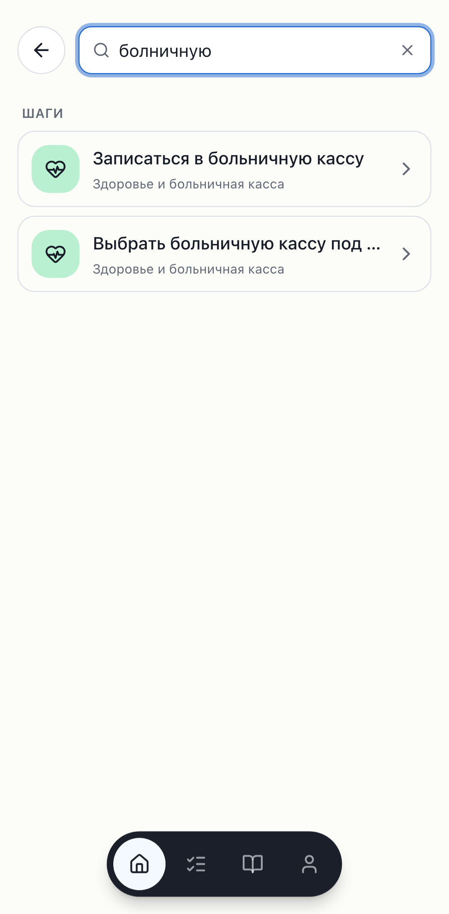
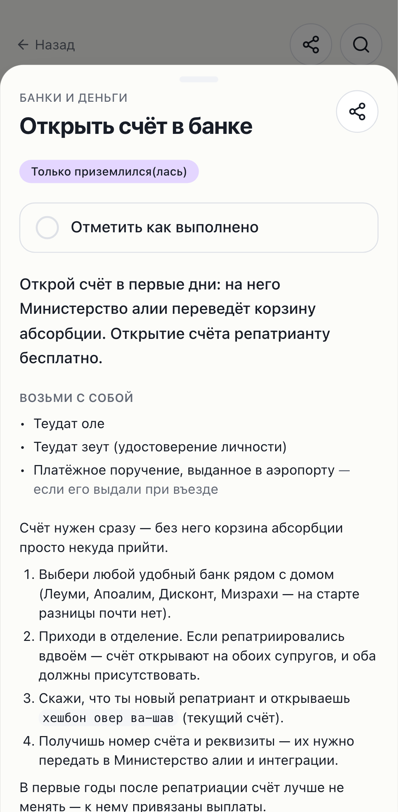

# Phase 6 — Search and SEO

Status: **complete** — code fully verified locally (unit, e2e incl. real FTS,
Lighthouse SEO/perf/a11y gates, JS-disabled SSR, sitemap/robots/OG) **and the search
migration pushed to the shared production remote** with the user's go-ahead, following
the neighbor ritual (evidence in "Remote migration push" below; `portfolio` untouched,
live FTS verified on prod). The only interim item is a Vercel deploy of this branch so
the new `/api/search` + pages ship (the DB is ready for them).

Branch: `phase-6/search-and-seo` (off the redesign tip, which is `origin/main` +
the post-merge motion commits). Scope held: no accounts/auth (Phase 7), no
AI/pgvector (Phase 8).

Commits (atomic):
- `docs(phase-6): housekeeping — commit 5.5 report, image provenance, roadmap deltas`
- `feat(search): real Postgres FTS + trigram search into the /search screen (6a)`
- `feat(seo): sitemap, robots, canonical, structured data, per-page OG + freshness (6b)`
- `test(search+seo): e2e search flows + a11y; Lighthouse SEO>=95 gate on content pages`
- `docs(phase-6): sweep README status, ARCHITECTURE (search/SEO/freshness), AGENTS`
- `docs(phase-6): add search-flow + SEO-page mobile screenshots`
- plus this report.

---

## Housekeeping ✅

- **phase-5.5 redesign report** committed (was untracked). Reviewed against the code:
  the "merged (PR #7, 339fc27)" claim is accurate — `origin/main` contains the merge;
  this branch is that plus the post-merge motion-saga commits. Migration filename,
  image inventory, and debts all check out.
- **`docs/IMAGES.md`** created — Unsplash provenance/license for the self-hosted
  section/hero webp images. Flagged debt: per-photo source URLs weren't recorded at
  selection time (the blanket Unsplash License covers use without attribution, so
  nothing is legally missing; backfill recommended for good citizenship).
- **`docs/ROADMAP.md`** actualized: Phase 6 rewritten for the redesign deltas (6a
  wires search into the existing `/search` shell; 6b builds on the SSR step sheets;
  canonical decision noted), Phase 9's Apple 4.2 case strengthened by the app-like
  UI, and the four redesign debts recorded (`/dev/ui` refresh, card-radius, oxide
  `@layer` patch watch, sheet-vs-Drawer parity).
- Phase 6 kickoff prompt moved into `docs/PROMPTS/`.

## 6a — Full-text search ✅

- **Migration `20260717120000_add_step_search.sql`** (additive, `public`-only):
  - `steps.search_vector` — a **STORED generated** `tsvector` (`russian` config,
    weighted title A > summary B > body C). The explicit `'russian'::regconfig` form
    is IMMUTABLE, so it's legal in a generated column — the vector stays correct on
    every `content:import` upsert with no trigger.
  - GIN index on the vector; `pg_trgm` (into `extensions`) GIN indexes on title +
    summary.
  - `public.search_steps(query, limit)` RPC (`SECURITY INVOKER`, under the existing
    public-read RLS). Ranks FTS hits (`websearch_to_tsquery` + `ts_rank`) first, with
    **word** similarity (`<%` / `word_similarity`) as the typo/partial safety net —
    full-string `%` dilutes to near-zero on long multi-word titles.
- **Transliteration story (documented in the migration + ARCHITECTURE):** Cyrillic-
  transliterated Hebrew (купат холим, рав-кав, теудат зеут) isn't in the dictionary,
  so the stemmer keeps it near-verbatim → exact forms match via FTS; typos (купат
  **халим**) match via word-similarity. Verified against the live RPC:

  | query | kind | top hit | time |
  |---|---|---|---|
  | `банк` | exact/partial | Подключить онлайн-банк… (banks) | 28ms |
  | `купат холим` | transliteration | Записаться в больничную кассу | 7ms |
  | `купат халим` | typo | Записаться в больничную кассу (rank 0.30) | 8ms |
  | `рав кав` | transliteration | Завести карту Рав-Кав | 8ms |
  | `виза` | no content | (empty → section suggestions) | 9ms |

  **6–28ms over the full 46-step set — well under the <150ms target.**
- **Server search (`lib/search/`)**: `search.ts` picks the DB RPC or, when no stack
  is configured (CI, preview, dev without Docker), a **pure matcher** (`match.ts`:
  substring + a JS `word_similarity` analogue), so the same exact/partial/typo flows
  work without a database. `GET /api/search?q=` returns grouped `{ steps, sections }`.
- **`/search` wired** (`components/search/search-view.tsx`): debounced (200ms,
  `AbortController` drops stale requests), results grouped **steps → section photo
  tiles**, empty state suggests section tiles, **query-restore on back-nav** kept,
  `search_performed` emitted via the env-gated analytics facade.

## 6b — Programmatic SEO ✅

- **Canonical decision (justified):** the existing `/guides/[section]/[step]` sheet
  URLs — which already SSR full content with their own title/description/`<h1>` — **are**
  the canonical step pages; `/guides/[section]` are the section pages. A separate
  `/gid/...` route was **rejected**: it would duplicate content and split link equity
  for no gain, since the sheet URLs are already real, indexable, crawlable pages.
  Each route sets `alternates.canonical` + OpenGraph.
- **`sitemap.xml`** from the DB (`app/sitemap.ts`): home, guides, **all 8 sections +
  46 steps** = 56 URLs; step `lastModified` from `last_verified_at`.
- **`robots.txt`** (`app/robots.ts`): allow guides; disallow `/plan`, `/api`,
  `/onboarding`, `/search`, `/offline`; sitemap advertised. `/plan/[slug]` keeps its
  `noindex`.
- **Structured data** (`lib/seo/structured-data.ts`, honest only): `BreadcrumbList`
  always; `HowTo` (steps parsed from the body list, "bring with you" docs →
  `HowToSupply`) **only** when the body genuinely lists ≥2 actions; `ItemList` for
  sections. Rendered via `components/seo/json-ld.tsx`.
- **Per-page OG images**: section + step `opengraph-image` routes reuse the Phase 5
  `next/og` infra (`lib/og/guide-image.tsx`). Verified: 200, `image/png`, ~52KB.
- **Freshness (closes the Phase 4 static-baking debt):** content routes + sitemap are
  **ISR** (`revalidate = 3600`), and `content:import` pings **`POST /api/revalidate`**
  (shared-secret) after a successful import → `revalidatePath("/", "layout")`
  regenerates everything on next request. No-op unless `SITE_REVALIDATE_URL` +
  `REVALIDATE_SECRET` are set.
- **RU-first**: JSON-LD `inLanguage: "ru"`, Russian content. Lighthouse SEO **100** on
  home/guides/section/step locally.

## Remote migration push (neighbor ritual — AGENTS rules 6 & 7) ✅

Executed with the user's explicit go-ahead. Remote project ref `zlcifmgakksqxkpowzaa`
(the shared portfolio project). DB access via the direct Postgres connection from
`.env.local` (`POSTGRES_URL_NON_POOLING`); pg tooling ran through a `postgres:17`
Docker image (the server is pg 17; local pg tooling can't dump/inspect it).

Evidence, in order:

1. **Remote server version** — `SHOW server_version` → **17.6**. ✅
2. **Neighbor backup** — `pg_dump -n portfolio` snapshot taken (**737 lines, 192K,
   8 tables**) into the session scratchpad. **Never committed.** ✅
3. **Remote state BEFORE** — `public` had the 5 content tables; `sections.image_url`
   already present; `portfolio` = **8 tables**. `schema_migrations` recorded only
   `20260711145729` (the 5.5 `image_url` change had been applied via direct SQL).
4. **Dry run** — `supabase db push --dry-run` listed `20260716120000` +
   `20260717120000` as the migrations it would apply. ✅
5. **Pushed** — `supabase db push --db-url …`: `20260716120000` re-applied
   idempotently (`NOTICE: column "image_url" … already exists, skipping`);
   `20260717120000` applied fresh. (A non-fatal `pgdelta` catalog-cache SSL warning
   printed — same class as Phase 5's — the DDL applied and was recorded.) Objects
   created in `public`: `pg_trgm` extension (into `extensions`), `steps.search_vector`
   generated column, `steps_search_vector_idx`, `steps_title_trgm_idx`,
   `steps_summary_trgm_idx`, and `public.search_steps(text,int)` + grant. Nothing
   referenced `portfolio`.
6. **Verified AFTER** — `schema_migrations` = `20260711145729`, `20260716120000`,
   `20260717120000`; `steps.search_vector` + `search_steps` + all 3 indexes present;
   **`portfolio` still 8 tables (untouched)**; live RPC on the remote returns real
   results — `search_steps('купат холим')` → «Записаться в больничную кассу»,
   `search_steps('болничную')` (typo) → the больничная-касса steps. ✅

**Interim:** the production Vercel deployment predates Phase 6, so the live site's
`/api/search` + SEO routes ship only when this branch deploys/merges. The DB is ready
now. The `content:import` → `/api/revalidate` freshness hook likewise activates once
the revalidate route is deployed (verified locally this session).

## Verification

| Check | Command | Result |
|---|---|---|
| Typecheck | `pnpm typecheck` | ✅ |
| Lint/format | `pnpm lint` | ✅ (155 files) |
| Unit + coverage | `pnpm test` | ✅ **204** tests (30 files); +search matcher, +structured-data, +search-view |
| Local FTS (migration applied) | `db:reset` → `content:import ../olim-content/content` → RPC | ✅ 8/46/4; 6–28ms; transliteration + typo verified |
| e2e (all specs, both projects) | `pnpm e2e` | ✅ **40 passed**, 2 skipped (DB round-trip); search flows + query-restore + axe both themes |
| e2e search vs real FTS | `pnpm e2e search.spec` (local stack) | ✅ 12 passed (`source: supabase`) |
| JS-disabled SSR | `curl` step/section HTML | ✅ h1 + body `<li>` + JSON-LD + canonical all in the served HTML |
| sitemap / robots | `curl /sitemap.xml`, `/robots.txt` | ✅ 56 URLs (2+8+46); robots disallows /plan,/api,… |
| OG image | `curl …/opengraph-image` | ✅ 200 image/png ~52KB |
| Lighthouse (mobile) | `pnpm lighthouse` | ✅ SEO **100** on /, /guides, /guides/[section], **/guides/[section]/[step]**; perf ≥90, a11y **100** everywhere |

Local medians (Lighthouse): perf / a11y / seo — `/` 90/100/100, `/guides` 92/100/100,
`/guides/healthcare` 94/100/100, `/guides/banks-and-money/open-bank-account`
94/100/100. `/plan` & `/onboarding` are excluded from the SEO gate by `assertMatrix`
(noindex/utility — low SEO there is correct, not a regression).

Screenshots (mobile) in `docs/PHASE_REPORTS/assets/phase-6/`:

| | |
|---|---|
| Search — empty (section suggestions) |  |
| Search — grouped results (steps → sections) |  |
| Search — typo tolerance (болничную) |  |
| SEO step page (SSR sheet, canonical, JSON-LD) |  |

## Post-review UX polish (owner device testing)

A round of fixes after the owner tested the build on a phone — all kept within the
SSR/SEO constraints of this phase:

- **Step sheet → drawer-grade, still SSR-safe.** The custom `BottomSheet` was
  hardened into a proper drawer: velocity-aware drag-to-close with rubber-banding +
  spring-back, focus trap, focus return, initial focus, body scroll-lock, Escape,
  backdrop dismiss. It stays **inline (portal-less)** deliberately — see the drawer
  decision below.
- **Navigation feedback → one top progress bar.** An accent-coloured
  `TopProgressBar` (dependency-free, `components/top-progress-bar.tsx`) replaced an
  earlier attempt with per-tile/per-tab spinners + full-screen route skeletons
  (which read as noisy). It uses **only `usePathname`** (never `useSearchParams`), so
  it does not force dynamic rendering — SSR/ISR/SEO untouched.
- **Onboarding exit.** The intro screen now has a back-to-home button (there was no
  way to leave the quiz from the intro).
- **Mobile search keyboard.** Tapping search primes the virtual keyboard by focusing
  a throwaway input inside the tap gesture, so iOS/Android raise the keyboard before
  the `/search` field mounts and inherits it (autofocus alone runs outside the
  gesture). No-op on non-touch devices — **verify on a real device.**
- **Floating tab bar** lifted ~0.75rem off the bottom safe-area edge.

## Drawer decision (reversal of the 5.5 "revisit shadcn Drawer" debt) — with evidence

The Phase 5.5 report left "bottom sheet: custom vs registry `Drawer`" open. Phase 6
**closes it: the custom inline sheet is retained**, because a portal-based drawer is
incompatible with the SSR step content that Phase 6 SEO depends on. Empirically:

- **vaul** (Radix Dialog underneath): the step page's SSR HTML contained no `<h1>`,
  no `role="dialog"`, and no step body — the content only appears after client mount.
- **Base UI** (the current shadcn Drawer): `Dialog.Portal` + `keepMounted` rendered
  **empty on the server** (`renderToStaticMarkup` length 0), and `Dialog.Popup`
  **refuses to mount without a `Portal`**.

Both would strip the step's h1/body/JSON-LD from the server HTML — breaking the
canonical step pages, the JS-off requirement, and Lighthouse SEO. A shared step URL
must SSR its content; opening a step in-app is also client state (not navigation), so
a portal drawer would add an RSC round-trip per tap. So the sheet is our own inline
implementation, now with drawer-grade behaviour (above). Both `vaul` and
`@base-ui-components/react` were installed, tested, and **removed** (no residual dep).

## shadcn-first audit

**No new shadcn primitives were added in Phase 6.** Search + SEO reuse existing
pieces: `SearchBar`, `SectionTile` (photo tiles for results/suggestions), `Skeleton`,
`Button`, and the redesign's `BottomSheet`. The bottom-sheet vs registry `Drawer`
question is now resolved (see the Drawer decision above). JSON-LD, OG, and the top
progress bar are non-visual / have no registry equivalent.

## Deferred / debts

1. ✅ **Remote search migration push** — done this session (ritual evidence above).
   Remaining interim step is a **Vercel deploy** of this branch so the `/api/search`
   route + SEO pages ship; the remote DB (RPC + indexes) is already live and verified.
2. **`.env.local` points at the production remote**, not the local stack — so
   `pnpm dev` locally talks to prod (which lacks the FTS migration until the push →
   fallback matcher). For local FTS work, run against the local stack (this session
   did so via an inline env override). Consider a `.env.development.local` pointing at
   `127.0.0.1:54321` if local-first dev is wanted.
3. **Local prod-build gotchas (not real bugs):** (a) the macOS-arm64 oxide `@layer`
   colour trap (AGENTS Known traps) — trust CI for dark-mode axe; (b) `next build`
   incremental staleness can miss a newly added route handler locally — `rm -rf .next`
   before a local e2e/lighthouse run. CI builds clean, so neither affects CI.
4. **Per-photo Unsplash URLs** to backfill in `docs/IMAGES.md` (see housekeeping).
5. Inherited debts unchanged: JS first-load guard at 280KB; PostHog/Sentry key-less
   until Phase 10 (`search_performed` now emitted through the facade).

## Verification commands

```
# local full-content + FTS (needs Docker):
pnpm db:reset && pnpm content:import --dir ../olim-content/content
pnpm typecheck && pnpm lint && pnpm test
# point the server at the local stack so e2e/lighthouse exercise the real FTS:
export NEXT_PUBLIC_SUPABASE_URL=http://127.0.0.1:54321
export NEXT_PUBLIC_SUPABASE_PUBLISHABLE_KEY=<local publishable key from `supabase status`>
rm -rf .next && pnpm e2e            # search flows + a11y, both themes
pnpm lighthouse                     # SEO ≥95 gate on content pages
```
