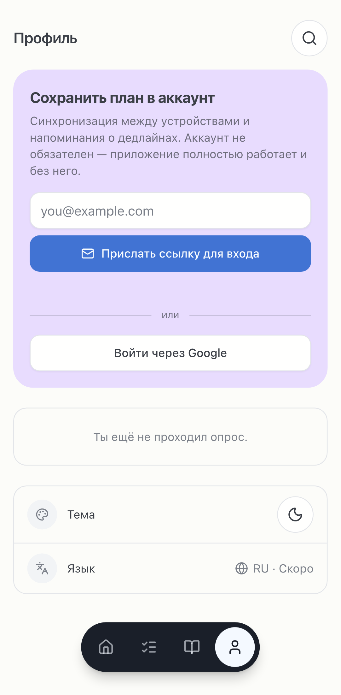
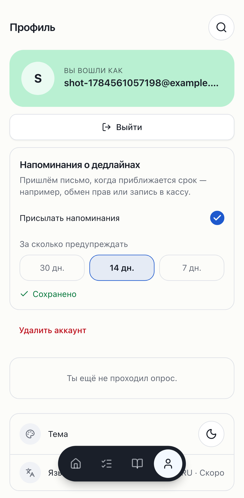
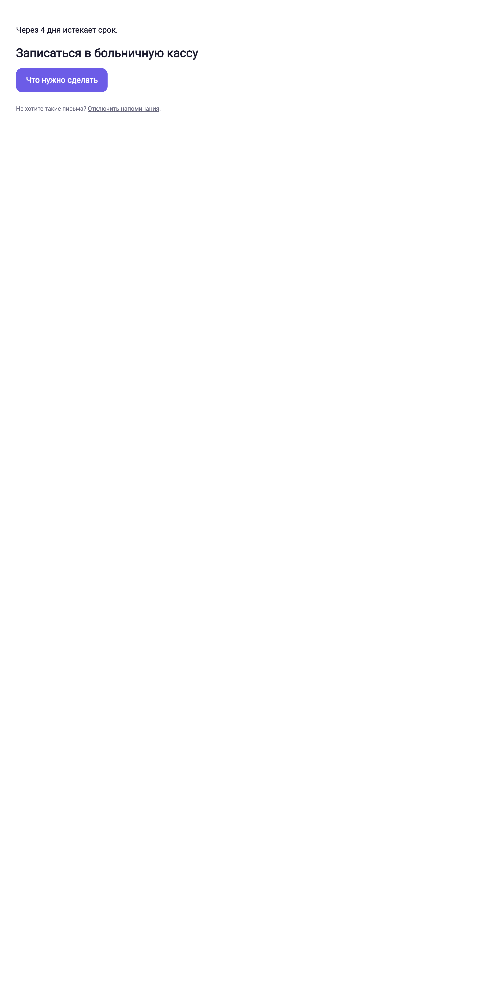

# Phase 7 — Accounts and reminders

Status: **complete and fully verified** — code, local suite (lint, typecheck, 239
unit, 50 e2e incl. the mandatory cross-user RLS denial + Mailpit magic-link flow,
Lighthouse on 8 routes incl. `/profile`), **the two migrations pushed to the shared
remote following the neighbor ritual** (evidence below; `portfolio` untouched), and
**one real reminder email delivered via Resend** to the owner's inbox with
duplicate-prevention proven. **Anonymous-first held throughout** — no login walls;
an account only adds sync + reminders.

Remaining items are dashboard-only and non-blocking (Google OAuth + prod
magic-link template + the cron schedule); see *Deferred*.

Branch: `phase-7/accounts-and-reminders` (off the Phase 6 tip). Scope held: no
AI/pgvector (Phase 8), no Capacitor (Phase 9).

---

## Housekeeping ✅ (closes Phase 6 debt #2)

The local-first `.env` split already existed in the working tree but was
undocumented. Formalized it: `.env.development.local` + `.env.production.local`
point at the local stack, `.env.local` keeps the shared prod remote; documented
the three-file layout in `.env.example` + `CONTRIBUTING.md`, and added the 7b
reminder env vars.

## Storage-model decision (justified)

**A dedicated `user_state` table, NOT an overload of `plans`.** `plans` are
ephemeral, publicly-readable-by-slug, deliberately **sanitized** share snapshots
(many per person; no city/dates/free text). The account's live state — full
profile answers (incl. city/arrival dates), checked steps, reminder prefs — is one
owner-only row with a different lifecycle and privacy model. Merging them into
`plans` would break the `plans = public share snapshot` invariant. So `user_state`
(`user_id` PK → `auth.users` `ON DELETE CASCADE`) with owner-scoped RLS. Recorded
in `docs/ARCHITECTURE.md`.

## 7a — Accounts ✅

- **Auth**: Supabase Auth via cookie-based `@supabase/ssr` — magic link (RU email
  template, `supabase/templates/magic_link.html`, wired in `config.toml` for local;
  prod template = dashboard) + Google OAuth. Browser client **code-split onto
  `/profile` only** (auth SDK ≈ 69 KB gz — measured; kept off the global bundle).
  `/auth/callback` exchanges the PKCE code. **No global middleware** → Phase 6
  ISR/SEO untouched. Decision recorded in ARCHITECTURE.
- **Profile UI** (redesign language): anonymous → one calm entry point
  ("Сохранить план в аккаунт — синхронизация и напоминания") with magic-link +
  Google; signed-in → email, avatar initial, sign out.
- **Migration on first sign-in + sync**: a global `SyncProvider` (plain `fetch`,
  no SDK) merges the device's localStorage plan into the account (server answers
  win, done-steps **unioned**) and claims this device's anonymous share-plans via
  the `SECURITY DEFINER` `claim_plans` RPC. Ongoing changes write through
  (`PUT /api/state`, debounced). The profile became a reactive store
  (`use-profile`) so a synced plan updates every screen with no reload.
  localStorage stays the offline cache (PWA works signed-in and out; sign-out keeps
  the cache).
- **RLS**: owner-scoped read/write/delete on `user_state` (authenticated only).
  **Cross-user denial is e2e-tested** at the REST layer (user B cannot read user
  A's row).
- **Account deletion**: `POST /api/account/delete` hard-deletes the `auth.users`
  row (admin API) → `user_state` + `reminder_log` cascade, owned share-plans
  disassociate (`plans.user_id` → NULL). `docs/PRIVACY.md` documents the data model,
  retention, and what anonymous share-plans remain.

## 7b — Deadline reminders ✅ (engine verified locally)

- **Shared date math**: `lib/plan/deadline-math.ts` — dependency-free single source
  of truth for the app's `computeWarning` (no-ext import) **and** the Deno Edge
  Function (relative `.ts` import — confirmed it bundles under `functions serve`,
  so no drift). Selection logic in `lib/reminders/compute.ts`, unit-tested.
- **Engine**: `supabase/functions/send-reminders` (Deno cron, `verify_jwt=false`;
  excluded from tsc/biome). Reads opted-in users + `warn_rule` steps, computes
  deadlines in the lead window, **claims** each `(user, step, threshold)` in
  `reminder_log` (unique → idempotent), and emails a RU reminder via **Resend**
  (deep link + one-click no-login unsubscribe). Dry-runs without `RESEND_API_KEY`.
- **Settings**: opt-in toggle + 30/14/7 lead time on the Profile screen
  (`PATCH /api/reminders`), stored on `user_state`.
- **Verification** (local stack): a test user due in 4 days → first invoke
  `considered:1`; second invoke `considered:0` (deduped by `reminder_log`); exactly
  one log row. **One real email delivered** to the owner's inbox via Resend
  (`sent:1`), and a second invoke did **not** resend (`sent:0`) — duplicate
  prevention proven with real delivery. Evidence below.

## Migrations (additive, `public`-only)

- `20260720120000_add_user_state.sql` — `user_state` + owner RLS + `claim_plans`.
- `20260720130000_add_reminder_log.sql` — `reminder_log` (unique idempotency key).

## Remote migration push (neighbor ritual — AGENTS rules 6 & 7) ✅

Executed with the user's explicit go-ahead against the shared remote (project
`zlcifmgakksqxkpowzaa`). pg tooling ran through a `postgres:17` Docker image (server
is 17.6; local `pg_dump` is 16). Evidence, in order:

1. **Remote version** — `show server_version` → **17.6**. ✅
2. **Neighbor backup** — `pg_dump -n portfolio` snapshot taken (**864 lines, 173 KB,
   8 tables**) into the session scratchpad. **Never committed.** ✅
3. **BEFORE** — `portfolio` = 8 tables; `schema_migrations` = `…145729, …16120000,
   …17120000`; `public.user_state` did not exist.
4. **Dry run** — `supabase db push --dry-run` listed exactly `20260720120000` +
   `20260720130000`. ✅
5. **Pushed** — both applied. (Non-fatal `pgdelta` SSL catalog-cache warning printed
   — same class as Phase 5/6; the DDL applied and was recorded.) Objects created in
   `public`: `user_state` (+2 indexes, +4 RLS policies, RLS on), `claim_plans(text[])`
   + grant, `reminder_log` (+index, +1 RLS policy, grants). Nothing referenced
   `portfolio`.
6. **AFTER** — `schema_migrations` now includes `20260720120000` + `20260720130000`;
   `user_state` + `reminder_log` + `claim_plans` present; `user_state` RLS on with 4
   policies, `reminder_log` 1 policy; **`portfolio` still 8 tables (untouched)**. ✅

## Verification

| Check | Command | Result |
|---|---|---|
| Lint/format | `pnpm lint` | ✅ (181 files) |
| Typecheck | `pnpm typecheck` | ✅ |
| Unit + coverage | `pnpm test` | ✅ **239** tests (36 files); +deadline-math, +reminders/compute, +sync/user-state, +created-shares |
| e2e (both projects) | `pnpm exec playwright test` | ✅ **50 passed**, 2 skipped (pre-existing DB round-trip) |
| — account e2e | `account.spec.ts` | ✅ anon→sign-in (Mailpit)→migrated→2nd device sees it→sign-out keeps cache; deletion; **cross-user RLS denial**; reminder-settings persistence; axe clean (both themes) |
| Reminder engine | `functions serve send-reminders` + invoke ×2 | ✅ computes (4d), dry-run, **idempotent** (2nd run considered:0), 1 log row |
| Lighthouse (mobile) | `pnpm lighthouse` | ✅ 8 URLs incl **`/profile`**: perf ≥90, a11y ≥95, script ≤280 KB all hold |
| Auth SDK weight | build chunk gz | `@supabase/ssr`+`supabase-js` ≈ **69 KB gz**, code-split onto `/profile` only |

### Reminder engine evidence (local)

```
# user due in 4 days, reminders on, lead 14
1st invoke → {"ok":true,"sent":0,"dryRun":1,"considered":1,
              "report":[{"step":"register-kupat-holim","days":4,"sent":false}]}
2nd invoke → {"ok":true,"sent":0,"dryRun":0,"considered":0,"report":[]}   # deduped
reminder_log → (user, register-kupat-holim, 14)   # exactly one row
```

## Screenshots (mobile)

| | |
|---|---|
| Sign-in (anonymous entry point) |  |
| Signed-in + reminder settings |  |
| Reminder email (RU template) |  |

## Deferred (dashboard-only, non-blocking)

1. **Google OAuth + prod magic-link template.** Google Cloud Console (OAuth client)
   + Supabase provider config, and the RU magic-link template in the prod dashboard,
   are dashboard steps. Magic link works fully locally (RU template in `config.toml`),
   so nothing is blocked. The app's `signInWithOAuth("google")` path is already wired.
2. **Reminder cron schedule.** The Edge Function is deployed-ready; scheduling it
   (Supabase dashboard Cron, or `pg_cron` + `pg_net` POSTing the function URL daily)
   is a dashboard step. Set `RESEND_API_KEY` as a Supabase function secret in prod.
3. **Vercel deploy** of this branch so the `/api/*` + `/auth/callback` routes ship
   (the remote DB is ready). Set the prod auth redirect URLs to the deployed origin.

## Debts

- Reminder cron scheduling lives in the dashboard, not in the repo — document the
  exact schedule when set.
- Inherited: JS first-load guard at 280 KB (the auth SDK sits comfortably under it
  on `/profile`); PostHog/Sentry keyless until Phase 10; per-photo Unsplash URLs to
  backfill; `/dev/ui` refresh; card-radius normalization; oxide `@layer` local
  prod-build colour trap (trust CI for dark-mode axe).
- Known e2e note: magic-link sign-in resends with backoff because GoTrue
  rate-limits repeat OTPs to the same email (~1s); Mailpit is the local mailer
  (not Inbucket) at `:54324`.

## Verification commands

```
# local stack (needs Docker; docker CLI is at
# /Applications/Docker.app/Contents/Resources/bin — add to PATH for supabase):
pnpm db:reset && pnpm content:import
pnpm lint && pnpm typecheck && pnpm test
rm -rf .next && pnpm build && pnpm start &      # local prod build (local stack via *.local)
pnpm exec playwright test                        # incl. account.spec (auth + RLS + reminders)
pnpm lighthouse                                  # 8 routes incl /profile
# reminder engine:
supabase functions serve send-reminders --no-verify-jwt
curl -X POST http://127.0.0.1:54321/functions/v1/send-reminders
```
